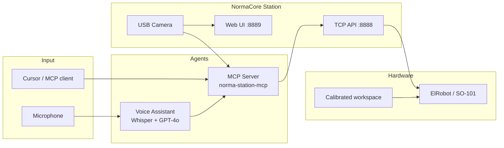

# NormaCore Berlin Hackathon

**Voice-controlled robotics with AI agents, computer vision, and MCP.**

This repository is our Berlin hackathon build on top of [NormaCore](https://normacore.dev) — an open robotics platform for real-time arm control, data collection, and deployment. We extended it with an MCP server, a voice assistant, vision-guided workspace calibration, and high-level pick/place tools so you can operate an ST3215 arm (ElRobot or SO-101) from Cursor, natural language, or speech.

---

## What we built

| Capability | Description |
|---|---|
| **MCP server** | 50+ tools exposed to AI assistants (Cursor, Claude, etc.) for joint motion, gripper control, pick/place, and board-square navigation |
| **Voice assistant** | Real-time speech → Whisper STT → GPT-4o → MCP tool calls → robot motion |
| **Vision stack** | Browser overlay (local contrast detection), optional Roboflow API, AprilTag mm calibration, and Python offline/live pipelines |
| **Board grid control** | 5×3 workspace grid with per-square pick and place (`go_to_square_8`, `place_at_square_3`, …) |
| **Pick & place** | Calibrated home pose, static pick pose, directional nudges, and lift/place sequences |
| **Personality** | `say_hi`, `acknowledge`, `dance`, and `gripper_wave` for demos and voice interaction |

### Architecture



---

## Quick start

### Prerequisites

- macOS (Apple Silicon tested) or Linux
- ST3215 robot arm connected via USB (ElRobot 7+1 DoF or SO-101 5+1 DoF)
- [uv](https://docs.astral.sh/uv/) — `curl -LsSf https://astral.sh/uv/install.sh | sh`
- Generated protobufs (from repo root):

```bash
make protobuf
```

### 1. Start NormaCore Station

Station bridges USB motors to a TCP API on port **8888** and serves the web UI on **8889**.

**Prebuilt binary (recommended):**

```bash
mkdir -p .tmp/station && cd .tmp/station

curl -L -o station-macos-arm64.zip \
  "https://github.com/norma-core/norma-core/releases/download/v0.1.0-beta.8/station-macos-arm64.zip"

unzip -o station-macos-arm64.zip
cp ../../software/station/bin/station/station.yaml .

RUST_LOG=info ./station --tcp --web --config station.yaml
```

Open **http://localhost:8889** to verify live motor data and the camera overlay.

Full setup options (build from source, desktop app, troubleshooting): [`software/station/mcp/README.md`](software/station/mcp/README.md)

### 2. Control from Cursor (MCP)

The repo ships `.cursor/mcp.json`. After station is running:

1. Reload MCP servers in Cursor (Settings → MCP → refresh)
2. Confirm **norma-station** appears with tools like `get_arm_state`, `go_home`, `pick_object`

Example prompts:

- *"What is the arm state?"*
- *"Go home and open the gripper"*
- *"Pick up the object and lift"*
- *"Go to square 9"*
- *"Say hi"*

### 3. Voice control (optional)

```bash
cd software/agents/voice_assistant
cp .env.example .env   # add OPENAI_API_KEY
uv run agent.py
```

When you see `READY!`, speak naturally:

- *"Go right"*, *"Move up a bit"*
- *"Pick up the object"*
- *"Put it in square 5"*
- *"Hey Joe, can you hear me?"* → triggers `acknowledge`

Details: [`software/agents/voice_assistant/README.md`](software/agents/voice_assistant/README.md)

### 4. Vision & workspace calibration (optional)

Copy `.env.example` to the repo root as `.env` and configure Roboflow if using cloud detection:

```bash
cp .env.example .env
```

In the station viewer: switch to **camera view** → click the **scan icon** for live object detection. Calibrate the workspace board for grid pick/place.

Details: [`software/station/vision/README.md`](software/station/vision/README.md)

---

## MCP tool reference

### High-level (preferred)

| Tool | Purpose |
|---|---|
| `get_arm_state` | Read joints, gripper, and detected arm type |
| `go_home` | Return to saved home pose in `.norma/home_pose.json` |
| `pick_object` / `lift_object` / `place_object` | Static pick/place sequence |
| `go_to_square` / `go_to_square_N` | Move to board square 1–15 and grasp |
| `place_at_square` / `place_at_square_N` | Place held object at a square |
| `move_direction` | Calibrated up / down / left / right nudge |
| `say_hi` / `acknowledge` / `dance` | Demo gestures |
| `detect_workspace_objects` | Vision offset from gripper (optional) |

### Low-level

| Tool | Purpose |
|---|---|
| `move_joint` / `move_arm_pose` | Joint-space motion (0.0–1.0 per motor) |
| `open_gripper` / `close_gripper` / `set_gripper` | Gripper control |
| `enable_arm_torque` / `disable_arm_torque` | Motor power |
| `advanced_*` | Raw motor bus access for debugging |

Joint IDs match motor IDs: **SO-101** joints 1–5 + gripper 6; **ElRobot** joints 1–7 + gripper 8. Positions are normalized within each motor's calibrated range, not Cartesian XYZ.

---

## Repository layout

```
norma-core-berlin-hackathon/
├── software/
│   ├── station/
│   │   ├── mcp/                  # MCP server (hackathon core)
│   │   ├── vision/               # Detection, workspace, AprilTags
│   │   ├── clients/station-viewer/  # Browser UI + local vision overlay
│   │   └── bin/station/          # NormaCore Station (Rust)
│   ├── agents/
│   │   └── voice_assistant/      # Whisper + GPT-4o voice agent
│   └── ai/smolvla_py/            # SmolVLA policy training & inference
├── hardware/
│   ├── elrobot/                  # 7+1 DoF arm (3D-printable)
│   └── pgripper/                 # Parallel jaw gripper
├── shared/
│   ├── gremlin_go/               # Protobuf SDK (Go)
│   └── gremlin_py/               # Protobuf SDK (Python)
├── .norma/                       # Local calibration (home pose, grid, nudges)
├── .cursor/mcp.json              # Cursor MCP configuration
└── .env.example                  # Vision / Roboflow environment template
```

---

## Calibration files

Local robot state lives under `.norma/` (gitignored secrets in `.env`):

| File | Purpose |
|---|---|
| `home_pose.json` | Arm rest pose — set via `save_home_pose` |
| `pick_calibration.json` | Board workspace + per-square joint targets |
| `manual_workspace.json` | Viewer workspace corners for vision overlay |
| `direction_nudge.json` | Teleop-calibrated directional joint deltas |

---

## NormaCore platform

This hackathon fork builds on the full NormaCore toolkit:

| Project | Path | Description |
|---|---|---|
| **ElRobot** | [`hardware/elrobot/`](hardware/elrobot/) | Fully 3D-printed 7+1 DoF arm for imitation learning |
| **Parallel Jaw Gripper** | [`hardware/pgripper/`](hardware/pgripper/) | Modular gripper for the SO-101 arm |
| **Station** | [`software/station/bin/station/`](software/station/bin/station/) | Real-time robotics platform — data collection, inference, control |
| **SmolVLA** | [`software/ai/smolvla_py/`](software/ai/smolvla_py/) | Train + deploy a [SmolVLA](https://huggingface.co/docs/lerobot/smolvla) policy |
| **Gremlin** | [`shared/gremlin_go/`](shared/gremlin_go/) · [`shared/gremlin_py/`](shared/gremlin_py/) | High-performance Protobuf SDK for Go and Python |

**Website:** [normacore.dev](https://normacore.dev)

**Community:**
- [Discord](https://discord.gg/Z4Ytw3QfHP)
- [GitHub](https://github.com/norma-core/norma-core)
- [X/Twitter](https://x.com/norma_core_dev)
- [YouTube](https://www.youtube.com/@normacoredev)

---

## Troubleshooting

| Problem | Fix |
|---|---|
| Nothing on port 8888 | Start station with `--tcp` |
| MCP tools fail | Station must be running first; reload MCP in Cursor |
| `Missing generated protobufs` | Run `make protobuf` from repo root |
| Arm won't move | Call `enable_arm_torque` before motion commands |
| Voice assistant errors | Set `OPENAI_API_KEY` in `software/agents/voice_assistant/.env` |
| Vision shows pixels not mm | Calibrate with AprilTags or camera intrinsics/extrinsics |

See also: [MCP setup guide](software/station/mcp/README.md) · [Vision guide](software/station/vision/README.md)

---

## License & attribution

Built at the **NormaCore Berlin Hackathon** on the open-source [NormaCore](https://github.com/norma-core/norma-core) platform.
