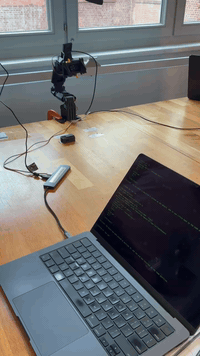
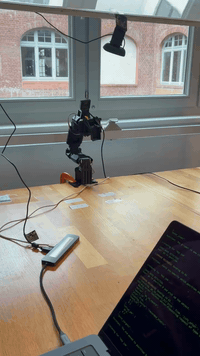
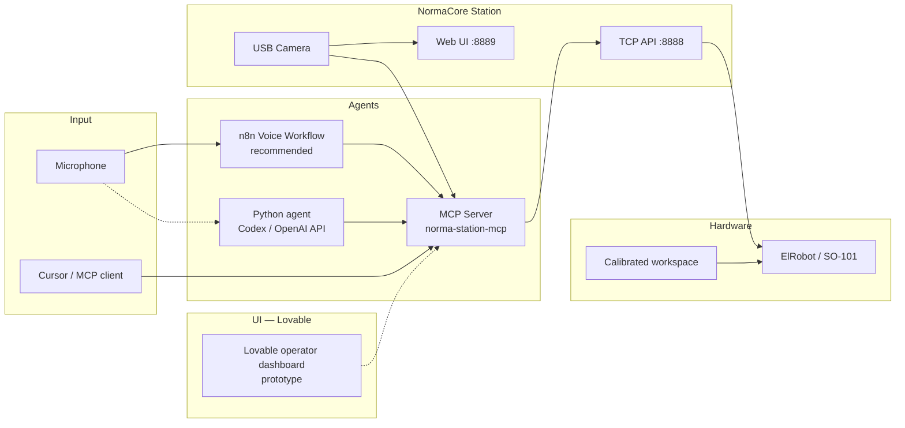

# NormaCore Berlin Hackathon

**Voice-controlled robotics with AI agents, computer vision, and MCP.**

This repository is our Berlin hackathon build on top of [NormaCore](https://normacore.dev) — an open robotics platform for real-time arm control, data collection, and deployment. We extended it with an MCP server, a voice assistant, vision-guided workspace calibration, and high-level pick/place tools so you can operate an ST3215 arm (ElRobot or SO-101) from Cursor, natural language, or speech.

**[How to run →](#how-to-run)**

---

## What we built

| Capability | Description |
|---|---|
| **MCP server** | 50+ tools exposed to AI assistants (Cursor, Claude, etc.) for joint motion, gripper control, pick/place, and board-square navigation |
| **Voice assistant** | Speech → MCP tool calls via **[n8n](https://n8n.io)** (recommended) or direct **Codex/OpenAI API** + local Python agent |
| **Vision stack** | Browser overlay (local contrast detection), optional Roboflow API, AprilTag mm calibration, and Python offline/live pipelines |
| **Board grid control** | 5×3 workspace grid with per-square pick and place (`go_to_square_8`, `place_at_square_3`, `transfer_object`, …) |
| **Pick & place** | Calibrated home pose, static pick pose, directional nudges, and lift/place sequences |
| **Station viewer UI** | Camera overlay, manual workspace calibration, and 5×3 grid on the live feed |
| **Lovable prototypes** | Future operator dashboard (board tap-to-move, transfer UI, voice status) — see [MCP README](software/station/mcp/README.md#ui-development-lovable--station-viewer) |
| **Personality** | `say_hi`, `acknowledge`, `dance`, and `gripper_wave` for demos and voice interaction |

---

## Demos

<table>
  <tr>
    <td align="center"><b>Say hi</b><br/><code>say_hi</code><br/></td>
    <td align="center"><b>Dance</b><br/><code>dance</code><br/></td>
  </tr>
  <tr>
    <td align="center"><b>Pick up</b><br/><code>go_to_square</code> / pick<br/></td>
    <td align="center"><b>Place</b><br/><code>place_at_square</code><br/></td>
  </tr>
</table>

<p align="center">
  <sub>Loops are GIF previews from <code>videos/</code>. MP4 versions available for lighter embeds — see <a href="videos/README.md">videos/README.md</a>.</sub>
</p>

---

## Hackathon development stack

**Use [n8n](https://n8n.io) for voice and [Lovable](https://lovable.dev) for UI.** That was our intentional split during the hackathon: n8n orchestrates the voice agent and tool calls; Lovable prototypes the operator dashboard. The in-repo Python voice script and Station viewer changes are supporting implementations — not the primary demo path.

| Tool | Use for | Why |
|------|---------|-----|
| **[n8n](https://n8n.io)** | Voice agent workflow | Visual orchestration of wake word → STT → LLM → MCP/HTTP → robot; easy to tweak prompts and wire new tools without redeploying Python |
| **[Lovable](https://lovable.dev)** | Operator UI | Fast React dashboard for board grid, transfer flows, and live status — see [UI section](software/station/mcp/README.md#ui-development-lovable--station-viewer) |
| **Cursor + MCP** | Engineering / debugging | Direct access to all `norma-station` tools while calibrating and testing motion |
| **Station viewer** | Calibration + vision | Board corners, gripper tip, camera overlay, grid — ships in this repo |

### Architecture



---

## How to run

End-to-end steps to reproduce the demos above. You need **two things running**: NormaCore Station (talks to the arm over USB) and a **control layer** (Cursor MCP, n8n, or the Python voice agent).

### Prerequisites

| Requirement | Check |
|-------------|-------|
| ElRobot or SO-101 on USB | `ls /dev/cu.usb*` (macOS) — should list a `usbmodem` device |
| [uv](https://docs.astral.sh/uv/) | `uv --version` |
| Protobufs generated | From repo root: `make protobuf` |

Clone and enter the repo:

```bash
git clone https://github.com/amirrezaalasti/norma-core-berlin-hackathon.git
cd norma-core-berlin-hackathon
make protobuf
```

### Terminal 1 — Start Station (always required)

Station exposes the arm on TCP **8888** and the web UI on **8889**.

```bash
mkdir -p .tmp/station && cd .tmp/station

curl -L -o station-macos-arm64.zip \
  "https://github.com/norma-core/norma-core/releases/download/v0.1.0-beta.8/station-macos-arm64.zip"

unzip -o station-macos-arm64.zip
cp ../../software/station/bin/station/station.yaml .

RUST_LOG=info ./station --tcp --web --config station.yaml
```

Leave this running. Verify:

- Browser: **http://localhost:8889** — live joints + camera
- Logs show 8 motors (ElRobot) or 6 (SO-101) and `NormFS server listening on 0.0.0.0:8888`

More options (build from source, desktop app): [`software/station/mcp/README.md`](software/station/mcp/README.md)

### Terminal 2 — Pick a control path

Choose **one** of the following.

#### A) Cursor + MCP (fastest to try)

1. Open this repo in **Cursor**
2. Settings → **MCP** → refresh — confirm **norma-station** is connected
3. Chat with the robot, e.g.:

   - *"Enable arm torque and go home"*
   - *"Say hi"* → matches [`videos/hi.gif`](videos/hi.gif)
   - *"Dance"* → matches [`videos/dance.gif`](videos/dance.gif)
   - *"Go to square 9 and pick"* → matches [`videos/pickup.gif`](videos/pickup.gif)
   - *"Place at square 15"* → matches [`videos/put.gif`](videos/put.gif)
   - *"Move the object from position 9 to position 15"* → `transfer_object`

MCP is configured in [`.cursor/mcp.json`](.cursor/mcp.json) (`STATION_HOST=localhost:8888`).

#### B) Voice — n8n (recommended for demos)

1. Start your **[n8n](https://n8n.io)** instance and import/open the voice workflow
2. Set credentials: OpenAI/Codex API key, `STATION_HOST=localhost:8888`
3. Activate the workflow — wake word *"hey joe"*, then speak commands (same as Cursor examples above)

See [`software/station/mcp/README.md` — Voice agent (n8n)](software/station/mcp/README.md#voice-agent-n8n--codex-api).

#### C) Voice — Python agent (Codex/OpenAI API direct)

```bash
cd software/agents/voice_assistant
cp .env.example .env    # set OPENAI_API_KEY
uv run agent.py
```

When you see `READY!`, speak naturally (*"go home"*, *"say hi"*, *"move from 9 to 15"*, etc.).

Details: [`software/agents/voice_assistant/README.md`](software/agents/voice_assistant/README.md)

#### D) MCP server only (debug / scripts)

```bash
# From repo root — stdio MCP (used by Cursor and the voice agent)
uv run --project software/station/mcp python -m norma_station_mcp
```

Test connection without MCP:

```bash
uv run --project software/station/mcp python -c "
import asyncio, json
from norma_station_mcp.session import StationSession

async def main():
    s = StationSession('localhost:8888')
    await s.ensure_connected()
    print(json.dumps(s.get_arm_state(), indent=2))

asyncio.run(main())
"
```

### Optional — Vision & board calibration

Before grid pick/place works on your desk, calibrate once in the Station viewer:

1. Open **http://localhost:8889** → camera view
2. Calibrate workspace corners + gripper tip (scan icon for live detection)
3. Poses are saved under `.norma/`

```bash
cp .env.example .env   # optional: ROBOFLOW_API_KEY for cloud detection
```

Details: [`software/station/vision/README.md`](software/station/vision/README.md)

### Stop everything

- Station terminal: **Ctrl+C**
- Voice agent: **Ctrl+C**
- n8n: deactivate workflow in the UI

---

## MCP tool reference

### High-level (preferred)

| Tool | Purpose |
|---|---|
| `get_arm_state` | Read joints, gripper, and detected arm type |
| `go_home` | Return to saved home pose in `.norma/home_pose.json` |
| `pick_object` / `lift_object` / `place_object` | Static pick/place sequence |
| `go_to_square` / `go_to_square_N` | Move to board square 1–15 and grasp |
| `place_at_square` / `place_at_square_N` | Place held object at a square |
| `transfer_object` | Pick at `from_square` and place at `to_square` in one call |
| `move_direction` | Calibrated up / down / left / right nudge |
| `say_hi` / `acknowledge` / `dance` | Demo gestures |
| `detect_workspace_objects` | Vision offset from gripper (optional) |

### Low-level

| Tool | Purpose |
|---|---|
| `move_joint` / `move_arm_pose` | Joint-space motion (0.0–1.0 per motor) |
| `open_gripper` / `close_gripper` / `set_gripper` | Gripper control |
| `enable_arm_torque` / `disable_arm_torque` | Motor power |
| `advanced_*` | Raw motor bus access for debugging |

Joint IDs match motor IDs: **SO-101** joints 1–5 + gripper 6; **ElRobot** joints 1–7 + gripper 8. Positions are normalized within each motor's calibrated range, not Cartesian XYZ.

---

## Repository layout

```
norma-core-berlin-hackathon/
├── software/
│   ├── station/
│   │   ├── mcp/                  # MCP server (hackathon core)
│   │   ├── vision/               # Detection, workspace, AprilTags
│   │   ├── clients/station-viewer/  # Browser UI + local vision overlay
│   │   └── bin/station/          # NormaCore Station (Rust)
│   ├── agents/
│   │   └── voice_assistant/      # Direct Codex/OpenAI API agent (n8n is recommended for demos)
│   └── ai/smolvla_py/            # SmolVLA policy training & inference
├── hardware/
│   ├── elrobot/                  # 7+1 DoF arm (3D-printable)
│   └── pgripper/                 # Parallel jaw gripper
├── shared/
│   ├── gremlin_go/               # Protobuf SDK (Go)
│   └── gremlin_py/               # Protobuf SDK (Python)
├── .norma/                       # Local calibration (home pose, grid, nudges)
├── videos/                       # Demo clips (GIF / MP4 for README, MOV sources)
├── .cursor/mcp.json              # Cursor MCP configuration
└── .env.example                  # Vision / Roboflow environment template
```

---

## Calibration files

Local robot state lives under `.norma/` (gitignored secrets in `.env`):

| File | Purpose |
|---|---|
| `home_pose.json` | Arm rest pose — set via `save_home_pose` |
| `pick_calibration.json` | Board workspace + per-square joint targets |
| `manual_workspace.json` | Viewer workspace corners for vision overlay |
| `direction_nudge.json` | Teleop-calibrated directional joint deltas |

---

## NormaCore platform

This hackathon fork builds on the full NormaCore toolkit:

| Project | Path | Description |
|---|---|---|
| **ElRobot** | [`hardware/elrobot/`](hardware/elrobot/) | Fully 3D-printed 7+1 DoF arm for imitation learning |
| **Parallel Jaw Gripper** | [`hardware/pgripper/`](hardware/pgripper/) | Modular gripper for the SO-101 arm |
| **Station** | [`software/station/bin/station/`](software/station/bin/station/) | Real-time robotics platform — data collection, inference, control |
| **SmolVLA** | [`software/ai/smolvla_py/`](software/ai/smolvla_py/) | Train + deploy a [SmolVLA](https://huggingface.co/docs/lerobot/smolvla) policy |
| **Gremlin** | [`shared/gremlin_go/`](shared/gremlin_go/) · [`shared/gremlin_py/`](shared/gremlin_py/) | High-performance Protobuf SDK for Go and Python |

**Website:** [normacore.dev](https://normacore.dev)

**Community:**
- [Discord](https://discord.gg/Z4Ytw3QfHP)
- [GitHub](https://github.com/norma-core/norma-core)
- [X/Twitter](https://x.com/norma_core_dev)
- [YouTube](https://www.youtube.com/@normacoredev)

---

## Troubleshooting

| Problem | Fix |
|---|---|
| Nothing on port 8888 | Start station with `--tcp` |
| MCP tools fail | Station must be running first; reload MCP in Cursor |
| `Missing generated protobufs` | Run `make protobuf` from repo root |
| Arm won't move | Call `enable_arm_torque` before motion commands |
| Voice assistant errors | n8n: check workflow credentials and MCP/HTTP node URL; direct agent: set `OPENAI_API_KEY` in `software/agents/voice_assistant/.env` |
| Vision shows pixels not mm | Calibrate with AprilTags or camera intrinsics/extrinsics |

See [How to run](#how-to-run) for the full setup. Quick copy-paste:

```bash
# Terminal 1 — station
cd .tmp/station && RUST_LOG=info ./station --tcp --web --config station.yaml

# Terminal 2 — voice (direct API)
cd software/agents/voice_assistant && uv run agent.py

# Or use Cursor MCP / n8n (see README)
```

More detail: [`software/station/mcp/README.md`](software/station/mcp/README.md) · [`software/agents/voice_assistant/README.md`](software/agents/voice_assistant/README.md)

---

## License & attribution

Built at the **NormaCore Berlin Hackathon** on the open-source [NormaCore](https://github.com/norma-core/norma-core) platform.
