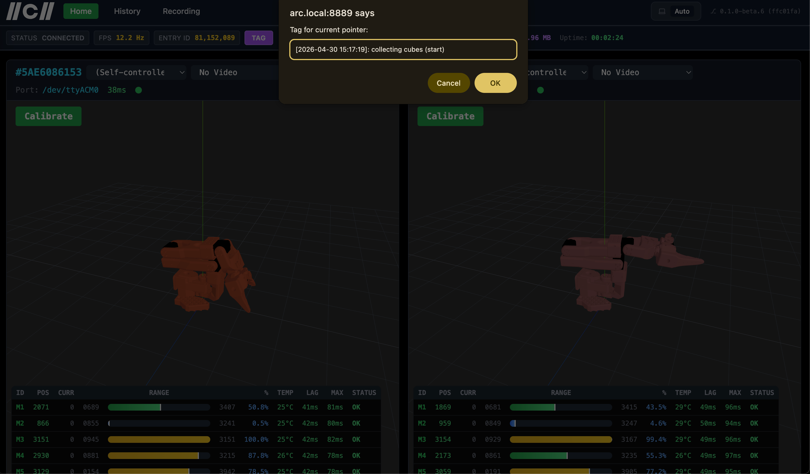
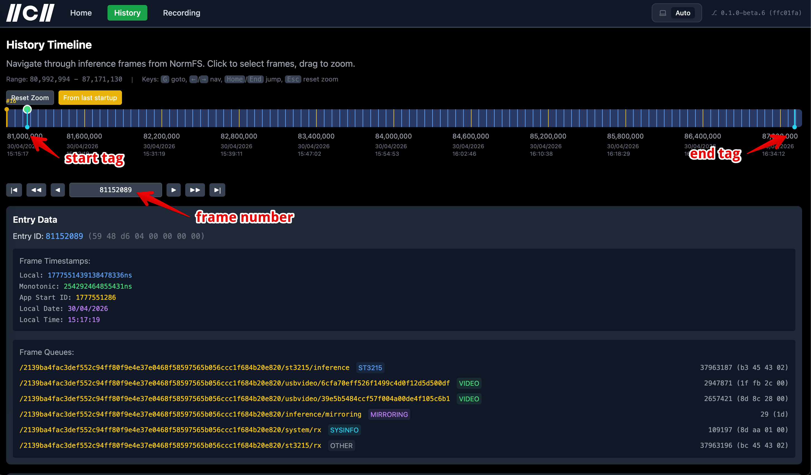

# 🚀 How to record datasets

Record and export datasets for training in a few steps.

## Recording steps

### Create the start tag

Press the `Tag` button and write down the tag name.




### Record the data

The default episode duration is 45 seconds. You can adjust it by using parameter `-episode.duration` in the export command.
The minimum time between two episodes is 5 seconds. 8-second reset time is recommended.
- Record an episode for a minimum specified episode duration (maximum is unlimited).
- Wait at least a minimum reset time.
- Repeat the above steps for the desired number of episodes.

### Create the end tag

Press the `Tag` button and write down the tag name.


### Get frame numbers

Go to `History`, find the start and end tags, and copy the frame numbers.



### Export the dataset (parquet file)

Run the following command (adjust it for your data):

```bash
.\dataset-generator \
  -episode.duration 35 \
  -from 18979274 \
  -to 22445334 \
  -robot 192.168.0.10 \
  -output ~/datasets/dataset-cube \
  -task "put the cube inside box"
```

Where:
- `episode.duration` — duration of the episode in seconds
- `from` — start frame number (your start tag)
- `to` — end frame number (your end tag)
- `robot` — IP address of the robot
- `output` — output path/prefix for the generated `.parquet` file
- `task` — task description
- `episode.min-commands` — minimum number of commands in the episode (default: 100)

After the dataset is generated, you can find the export log in the CLI. It shows which episodes were saved, which were discarded, and the reason for discarding.

> **Note:** If you see `insufficient commands (93 < 100)`, add the `episode.min-commands` parameter and re-export the dataset.

## View the dataset (optional)

You can inspect the dataset by converting it to an mp4 file and watching it in a video player.

```bash
.\dataset-mp4 \
  --input ~/datasets/dataset-cube.parquet \
  --output ~/datasets/dataset-cube.mp4
```

Where:
- `input` — input dataset
- `output` — output mp4 file

## Schema (one row = one frame)
|                                  |                                                                                                                                                                                         |                                                 |
|----------------------------------|-----------------------------------------------------------------------------------------------------------------------------------------------------------------------------------------|-------------------------------------------------|
| **column**                       | **type**                                                                                                                                                                                | **meaning**                                     |
| episode_start_ns                 | uint64 non-null                                                                                                                                                                         | wall-clock UNIX-ns of the episode's first frame |
| global_frame_id                  | binary non-null                                                                                                                                                                         | LE-encoded frame id                             |
| timestamp_ns_since_episode_start | uint64 non-null                                                                                                                                                                         | per-episode time, starts at 0                   |
| joints                           | list<struct{<br/>range_min: u32, <br/>range_max: u32, <br/>position: u32, <br/>position_norm: f32, <br/>goal: u32, <br/>goal_norm: f32, <br/>current_ma: u32, <br/>velocity: u32<br/>}> | per-servo telemetry, raw + normalized           |
| images                           | list<struct{jpeg:binary}>                                                                                                                                                               | one JPEG blob per camera, embedded              |
| task                             | string                                                                                                                                                                                  | natural-language task                           |